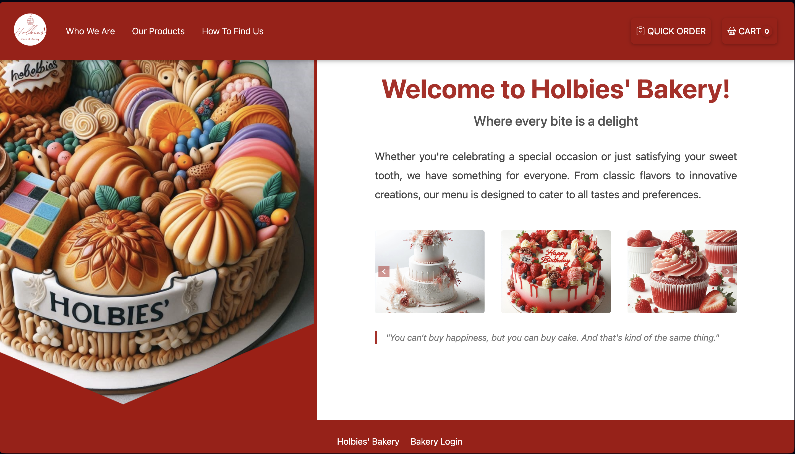

# Holbies' Bakery

## Overview

Holbies Bakery is a food-ordering web application focusing on cakes and bakery items. Customers can browse through a variety of products, place orders, and receive deliveries. The backend is powered by Django Framework, Python, while the frontend uses HTML, CSS, and JavaScript.

## Project Structure

- `cart/`: Contains the cart application managing items in the cart.
- `customer/`: Contains customer-related functionalities like registration and profile management.
- `deliver/`: Contains project set-up and setting files.
- `media/`: Stores media files like images.
- `restaurant/`: Manages restaurant-related functionalities.
- `templates/`: Contains HTML templates for the project.
- `db_backup.json`: Backup of the database.
- `db.sqlite3`: SQLite database file.
- `manage.py`: Command-line utility for Django.
- `requirements.txt`: List of project dependencies.

## Features

- Browse and search for bakery items.
- Add items to the cart and place orders.
- Guest checkout system.
- Order confirmation via email.

## Installation

### Prerequisites

- Python 3.12.1
- Django 4.2


### Setup

1. **Clone the repository:**
   ```bash
   git clone https://github.com/lunarinaa/holbertonschool-portfolio_project.git
   cd holbies_bakery

2. **Create and activate a virtual environment:**
   ```bash
   python3 -m venv venv
   source venv/bin/activate

3. **Install dependencies:**
   ```bash
   pip install -r requirements.txt

4. **Set up the database:**
   ```bash
   python manage.py migrate

5. **Create a superuser**
   ```bash
   python manage.py createsuperuser

6. **Run the development server:**
   ```bash
   python manage.py runserver

7. **Access the application:**

   Open your web browser and go to http://localhost:8000

## Landing Page Screenshot

Here is a screenshot of our landing page:



## Contributing
- Fork the repository.
- Create a new branch (git checkout -b feature-branch).
- Make your changes and commit (git commit -m 'Add some feature').
- Push to the branch (git push origin feature-branch).
- Open a Pull Request.

## Authors 
- Aydan Jafarli
- Fuad Mammadov
- Gulnar Rahimova
- Tuzala Imanova

## Contact

For any inquiries or issues, please contact the authors.


